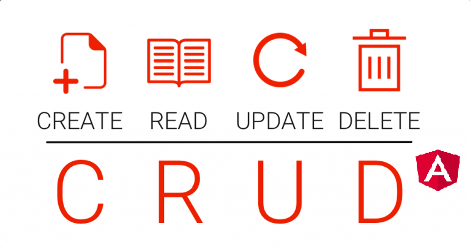

 <h1 align = "center">
    
 </h1>


[](https://travis-ci.org/joemccann/dillinger)


---

# Indice
- [Objetivo](#Objetivo)
- [Sobre](#sobre)
- [Conteúdo aplicado](#Conteúdo-aplicado)
- [Tecnologias utilizadas](#Tecnologias-utilizadas)
- [Como baixar o projeto](#Como-baixar-o-projeto)

## 🏆Objetivo

* Desenvolver uma Aplicação com Angular 9

* Utilizar os principais conceitos do Angular 9: Componentes, Diretivas, Pipes, Services e muito mais

* Criar uma Aplicação de Cadastro (CRUD) com Criação, Leitura, Atualização e Exclusão de Produto

* Aprender Angular na Prática de forma muito objetiva

---

## 📝Sobre

Mantido pela gigante da tecnologia Google, o *Angular 9* é um dos principais frameworks frontend do mercado! Aprender sobre Angular 9 é um grande diferencial na carreira qualquer dev, e neste curso eu estou aprendendo de forma extremamente prática e objetiva sem esquecer dos fundamentos e conceitos do Angular!

---

## 📚Conteúdo aplicado:

- Componentes
- Módulos
- Diretivas
- Services
- Injeção de Dependências
- Pipes
- Navegação
- Observables
- Consumir uma API Rest

---

## 🚀Tecnologias utilizadas

O projeto foi desenvolvido utilizando as seguintes tecnologias:

- [Typescript](https://www.typescriptlang.org/)
- [HTML](https://www.w3schools.com/html/)
- [CSS](https://developer.mozilla.org/pt-BR/docs/Web/CSS)
- [Angular9](https://angular.io/)

---

## 📁Como baixar o projeto

### Para iniciar a aplicação no backend
```bash 
    #clonar repositório
    git clone https://github.com/leandross86/Crud_Angular9
    #abrir o diretório backend
    cd backend
    #iniciar o backend da aplicação
    npm start
```
### Para iniciar a aplicação no frontend
```bash
    #abrir outro terminal
    #abrir o diretório frontend
    cd frontend
    #iniciar o frontend da aplicação
    npm start
```

---

## Créditos

- [Cod3rCursos](https://www.cod3r.com.br/courses/angular-9-essencial)

### Em desenvolvimento
